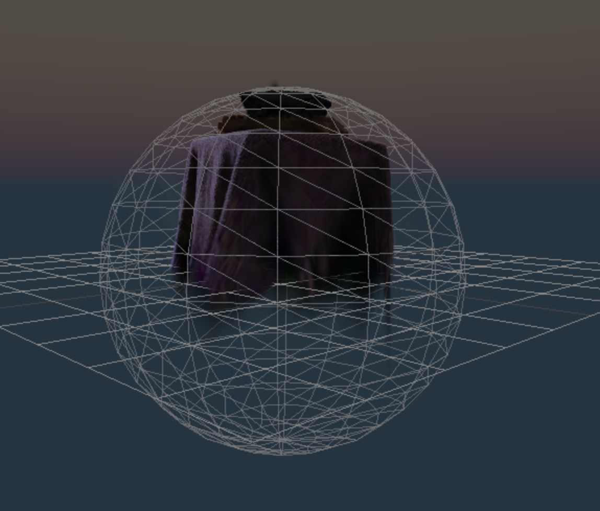
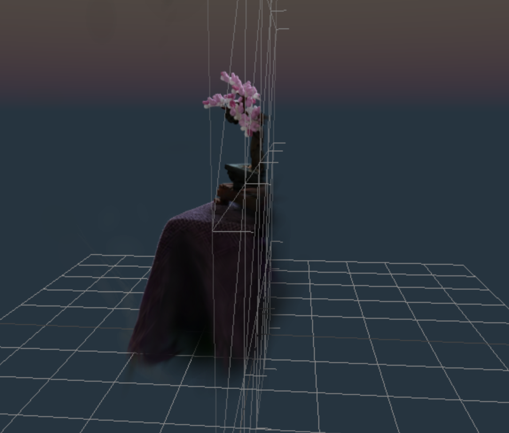

# Gaussian Splats for ThreeJS

This library allows you to render [3D Gaussian Splats](https://github.com/graphdeco-inria/gaussian-splatting) using the 3D rendering platform ThreeJS.


You may also be interested in [Mattercraft](https://zap.works/mattercraft/), a browser based 3D content development environment perfected for building interactive experiences for the web.

## Table Of Contents

<details>
<summary>Click to expand table of contents</summary>

<!--ts-->
   * [Gaussian Splats for ThreeJS](#gaussian-splats-for-threejs)
      * [Table Of Contents](#table-of-contents)
      * [Starting Development](#starting-development)
         * [NPM Package](#npm-package)
         * [Quick Start](#quick-start)
            * [GitHub Templates](#github-templates)
      * [GaussianSplatMesh](#gaussiansplatmesh)
         * [Loading](#loading)
         * [Adding To Scene](#adding-to-scene)
         * [Updating the mesh](#updating-the-mesh)
      * [Masking](#masking)
         * [Sphere](#sphere)
         * [Plane](#plane)
         * [Helper](#helper)
         * [Performance](#performance)
      * [How do i get .splat files?](#how-do-i-get-splat-files)
      * [License](#license)

<!-- Added by: root, at: Tue Dec 19 18:30:05 UTC 2023 -->

<!--te-->
</details>

## Starting Development

You can use this library by <!--  downloading a standalone zip containing the necessary files, by linking to our CDN, or by--> installing from NPM.

<!-- ### Standalone Download

Download the bundle from:
<https://libs.zappar.com/three-guassian-splat/CI_COMMIT_TAG/three-guassian-splat.zip>

Unzip into your web project and reference from your HTML like this:

```html
<script src="three-guassian-splat.js"></script>
```

### CDN

Reference the three-guassian-splat.js library from your HTML like this:

```html
<script src="https://libs.zappar.com/three-guassian-splat/CI_COMMIT_TAG/three-guassian-splat.js"></script>
``` -->

### NPM Package

Run the following NPM command inside your project directory:

```bash
npm install --save @zappar/three-guassian-splat
```

Then import the library into your JavaScript or TypeScript files:

```ts
import * as ZapSplat from '@zappar/three-guassian-splat';
```

_Please note - This library supports Webpack 5 and later._

### Quick Start

You can integrate the library with the existing `requestAnimationFrame` loop of your ThreeJS project. A typical project may look like this. The remainder of this document goes into more detail about each of the component elements of this example.

```ts
import * as ZapSplat from '@zappar/three-gaussian-splat';

const bonsai = new URL('./bonsai.splat', import.meta.url).href;
const maxSplats = Infinity;
const splat = new ZapSplat.GaussianSplatMesh(camera, renderer, bonsai, maxSplats);
splat.load();
scene.add(splat);

renderer.setAnimationLoop(animation);

function animation() {
  splat.update();
  renderer.render(scene, camera);
}
```

#### GitHub Templates

Explore our template project at this link: [Three Gaussian Splat Example on GitHub](https://github.com/zappar-xr/three-gaussian-splat-example)

For a live preview, visit:
[Three Gaussian Splat Example Preview](https://zappar-xr.github.io/three-gaussian-splat-example/)

## GaussianSplatMesh

You can use the `GaussianSplatMesh` to construct the splat mesh. It takes 2 arguments.

```ts
const splat = new ZapSplat.GaussianSplatMesh(
  url, // url to .splat file
  maxSplats // Maximum number of splats to render. Default = Infinity.
);
```

### Loading

To start loading the `.splat` file, call the `load` function.

```ts
splat.load();
```

You may optionally choose to provide a `THREE.LoadingManager` to track the loading progress:

```ts
const loadingManager = new THREE.LoadingManager();
splat.load(loadingManager);
```

### Adding To Scene

The GaussianSplat mesh can be added to the scene like any other `Object3D`:

```ts
scene.add(splat);
```

### Updating the mesh

The mesh needs to be updated before rendering. This can be done by calling the `update` function.

```ts
splat.update(
  camera, // THREE.PerspectiveCamera
  renderer // THREE.WebGLRenderer
);
```

## Masking

The library provides two meshes to define invisible areas of your splat.


### Sphere

A `MaskingShere` can be added to the `GaussianSplatMesh` to hide anything outside of the sphere.



```ts
const splat = new ZapSplat.GaussianSplatMesh(bonsai, Infinity);
splat.load();
scene.add(splat);

const maskSphere = new ZapSplat.MaskingSphere();

splat.addMaskMesh(maskSphere);
maskSphere.position.y = 0.9;
maskSphere.scale.setScalar(2.5);
// set to invisible once finalized position
maskSphere.visible = false;
renderer.setAnimationLoop(animation);

function animation() {
  splat.update(camera, renderer);
  renderer.render(scene, camera);
}
```

### Plane

A `MaskingPlane` can be added to the `GaussianSplatMesh` to hide anything in the planes normal direction.



```ts
const splat = new ZapSplat.GaussianSplatMesh(bonsai, Infinity);
splat.load();
scene.add(splat);

const maskPlane = new ZapSplat.MaskingPlane();

splat.addMaskMesh(maskPlane);
renderer.setAnimationLoop(animation);

function animation() {
  splat.update(camera, renderer);
  renderer.render(scene, camera);
}
```

### Helper

To aid development, the `MaskMesh` objects are rendered with a wireframe material. You can hide this by setting the `visible` property to `false`.

### Performance

For devices that support `SharedArrayBuffer`, the sorting process within this library is significantly optimized. This feature enhances the efficiency of data handling, leading to faster rendering times and smoother user experiences.

To check if your device supports `SharedArrayBuffer`, please refer to <https://caniuse.com/sharedarraybuffer>

## How do i get .splat files?

- https://github.com/dylanebert/gsplat.js#faq

Splat format discussion https://github.com/mkkellogg/GaussianSplats3D/issues/47

## License

This project is released under the MIT license. It is built upon several other open-source projects:

- [gsplat.js](https://github.com/dylanebert/gsplat.js), MIT License (c) 2023 Dylan Ebert
- [three.js](https://github.com/mrdoob/three.js), MIT License (c) 2010-2023 three.js authors
- [antimatter15/splat](https://github.com/antimatter15/splat), MIT License (c) 2023 Kevin Kwok
- [UnityGaussianSplatting](https://github.com/aras-p/UnityGaussianSplatting), MIT License (c) 2023 Aras Pranckevičius

Please note that the license of the original [3D Gaussian Splatting](https://github.com/graphdeco-inria/gaussian-splatting) research project is non-commercial. While this library provides an open-source rendering implementation, users should consider the source of the splat data separately.
